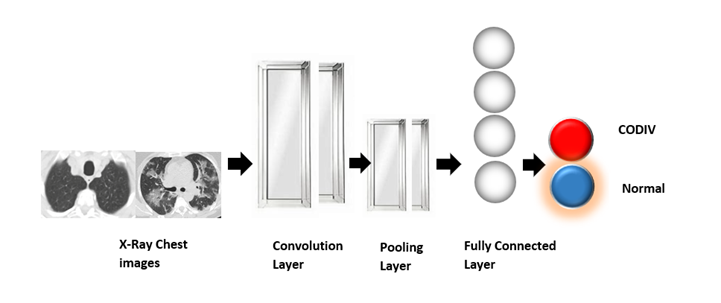
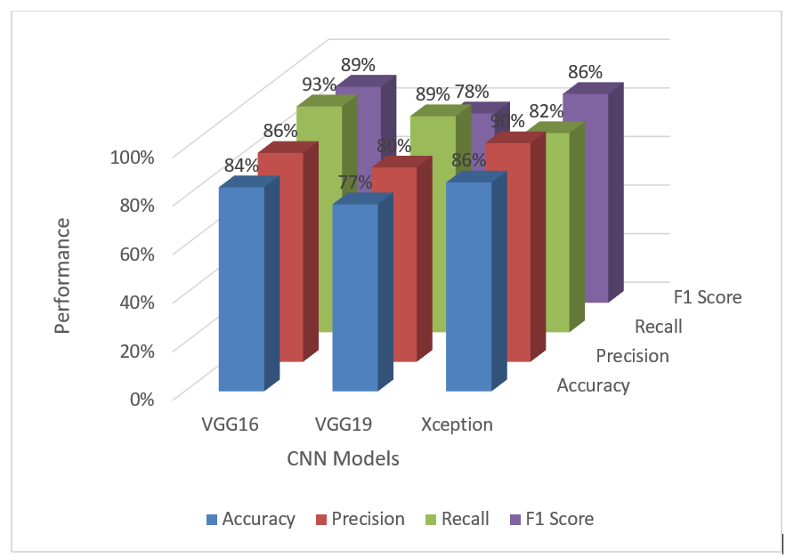

# COVID-19 CNN Python Application

## About
Employ Python based convolutional neural network (CNN) models for diagnosing COVID-19 from chest X-ray images

## Methodology

- **CNN Models Used**
  VGG16, VGG19 and Xception

- **CNN Model Architecture**
  
  

- **CNN Model Performance**

  

### Dataset
- Dataset Link - [SARS-COV2-Ct-Scan Dataset](https://www.kaggle.com/plameneduardo/sarscov2-ctscan-dataset)
