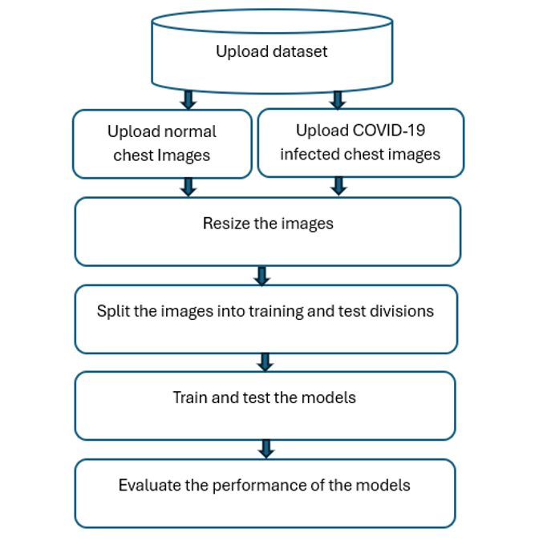
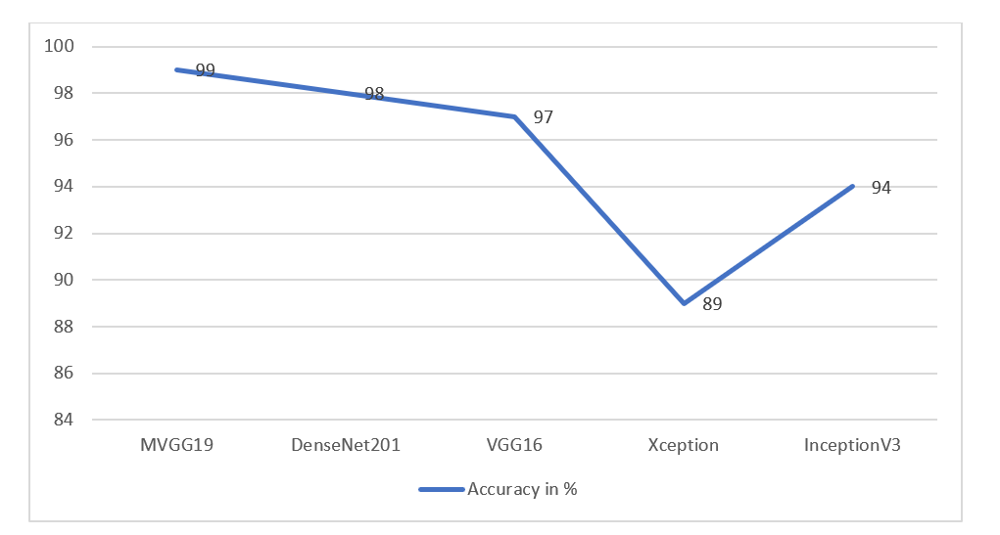

# COVID-19 CNN Python Application
Ths code contains Python based convolutional neural network (CNN) models for diagnosing COVID-19 using chest X-ray images.

- **CNN Model Training Process**

- **CNN Model Performance**

 
### Dataset
- Dataset Link - [SARS-COV2-Ct-Scan Dataset](https://www.kaggle.com/plameneduardo/sarscov2-ctscan-dataset)

